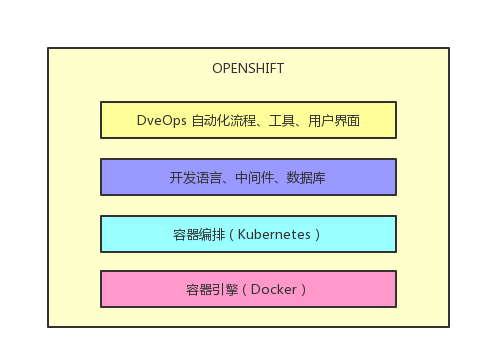
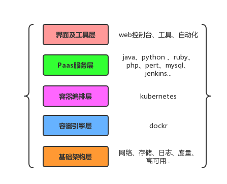
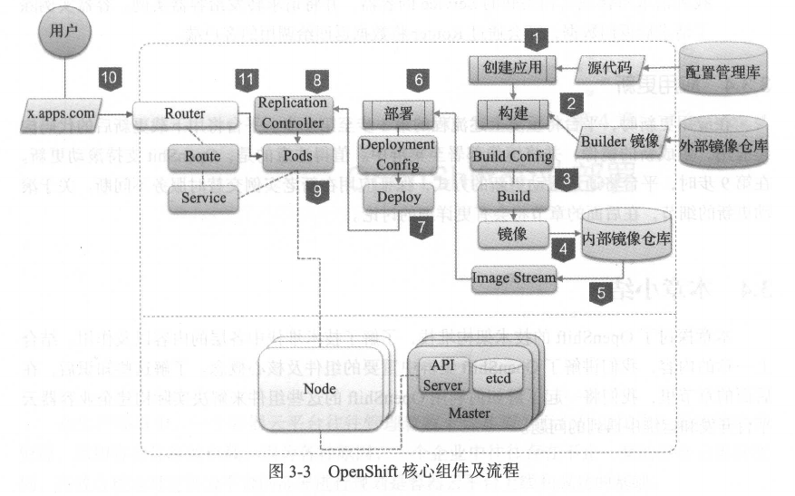

# openshift

## 技术栈



## 架构



## 核心组件及流程



## 环境搭建

```shell

```

## oc指令

```text
Basic Commands:
  types           An introduction to concepts and types
  login           Log in to a server
  new-project     Request a new project
  new-app         Create a new application
  status          Show an overview of the current project
  project         Switch to another project
  projects        Display existing projects
  explain         Documentation of resources
  cluster         Start and stop OpenShift cluster

Build and Deploy Commands:
  rollout         Manage a Kubernetes deployment or OpenShift deployment config
  rollback        Revert part of an application back to a previous deployment
  new-build       Create a new build configuration
  start-build     Start a new build
  cancel-build    Cancel running, pending, or new builds
  import-image    Imports images from a Docker registry
  tag             Tag existing images into image streams

Application Management Commands:
  get             Display one or many resources
  describe        Show details of a specific resource or group of resources
  edit            Edit a resource on the server
  set             Commands that help set specific features on objects
  label           Update the labels on a resource
  annotate        Update the annotations on a resource
  expose          Expose a replicated application as a service or route
  delete          Delete one or more resources
  scale           Change the number of pods in a deployment
  autoscale       Autoscale a deployment config, deployment, replication controller, or replica set
  secrets         Manage secrets
  serviceaccounts Manage service accounts in your project

Troubleshooting and Debugging Commands:
  logs            Print the logs for a resource
  rsh             Start a shell session in a pod
  rsync           Copy files between local filesystem and a pod
  port-forward    Forward one or more local ports to a pod
  debug           Launch a new instance of a pod for debugging
  exec            Execute a command in a container
  proxy           Run a proxy to the Kubernetes API server
  attach          Attach to a running container
  run             Run a particular image on the cluster
  cp              Copy files and directories to and from containers.

Advanced Commands:
  adm             Tools for managing a cluster
  create          Create a resource from a file or from stdin.
  replace         Replace a resource by filename or stdin
  apply           Apply a configuration to a resource by filename or stdin
  patch           Update field(s) of a resource using strategic merge patch
  process         Process a template into list of resources
  export          Export resources so they can be used elsewhere
  extract         Extract secrets or config maps to disk
  idle            Idle scalable resources
  observe         Observe changes to resources and react to them (experimental)
  policy          Manage authorization policy
  auth            Inspect authorization
  convert         Convert config files between different API versions
  import          Commands that import applications
  image           Useful commands for managing images
  registry        Commands for working with the registry
  api-versions    Print the supported API versions on the server, in the form of "group/version"
  api-resources   Print the supported API resources on the server

Settings Commands:
  logout          End the current server session
  config          Change configuration files for the client
  whoami          Return information about the current session
  completion      Output shell completion code for the specified shell (bash or zsh)

Other Commands:
  ex              Experimental commands under active development
  help            Help about any command
  plugin          Runs a command-line plugin
  version         Display client and server versions
```

## 常用指令

```shell
# 赋予dev管理员权限
oc adm policy add-cluster-role-to-user cluster-admin dev

# 内网环境下启动
sudo ./oc cluster up --http-proxy='http://172.17.18.80:808' --https-proxy='http://172.17.18.80:8080' --no-proxy=''
```
